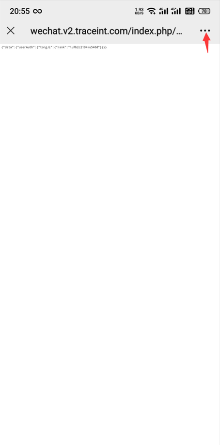
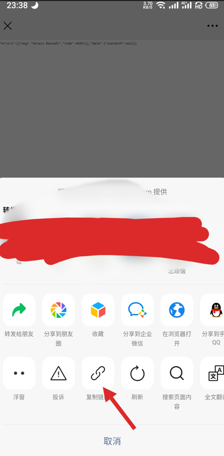
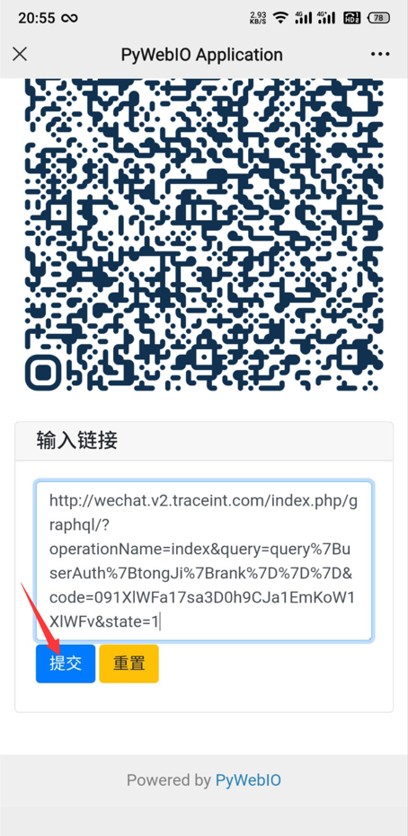
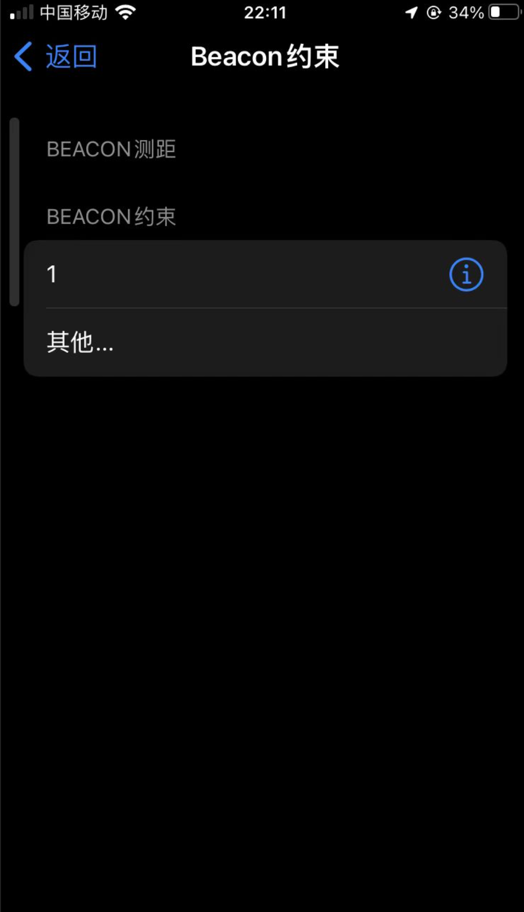
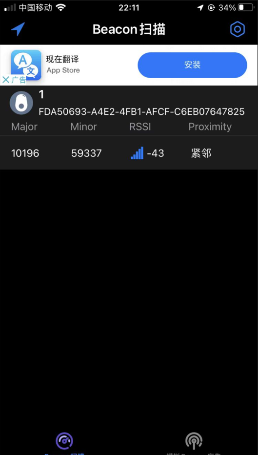

# 我去图书馆选座-个人版

### 简介

我去图书馆选座个人使用版-完全开源免费使用

- 采用Pywebio实现前后端不分离web开发

- 采用apscheduler模块实现定时任务的动态增删改查

- 采用memcached内存数据库，高速缓存cookie、座位等信息

- 无数据库模式，重启即信息失效

- Docker快速一键搭建，腾讯云精选特惠：[点我进入](https://curl.qcloud.com/y7fKu56t)


### 功能

1. 定时选座、明日预约
2. cookie自动保活
3. 一键远程打卡（仅限支持蓝牙签到的学校）
4. 自动完成积分任务：积分签到、自动暂离、自动退座

### 使用docker运行

```shell
docker run -d -e username=USER -e password=PWD --network host --name igotolib shiguang2/igotolib-person:latest
```

USER填写用来登录的账号

PWD填写用来登录的密码

注：默认使用80端口，如需要更改端口为8080可使用

```
docker run -d -p 8080:80 -e username=USER -e password=PWD --name igotolib shiguang2/igotolib-person:latest
```

### 使用教程

运行成功后，打开http://ip:80

即可使用，账号和密码填写上面设置的。

#### 设置位置和时间

首先在我去图书馆的公众号里，设置好常用座位。

点击设置座位及时间

第一次使用会出现以下情况：

长按二维码，微信识别二维码，会进入一个网页，复制网页的链接填写到二维码下的框内，提交。（一般只需要提交一次链接，如果之后也出现了，说明状态失效，按上面流程再提交一次链接）



进去会看到你在公众号设置的常用座位，填写好选座时间和选座任务，提交即可。

说明：

位置下面会提示当前你选的座位在我脚本系统里已有的个数，为了保证你能选到座位，如发现大于1请更换座位。

只可运行一个定时选座任务或明日预约任务。

#### 修改座位信息

先在公众号里修改常用座位，再去主页点击设置座位及时间，就会看到座位信息已经更改，并点击提交就会生效了。

#### 打卡（仅支持蓝牙打卡的学校）

先更新信息，填写链接方法与上面相同。有两个参数：Major、Minor。获取方式请看下面教程：

##### 安卓手机：

打开链接https://wwn.lanzouj.com/iV9mw03eqzsh下载安装nRF Connect，打开软件给蓝牙定位权限，打开手机定位和蓝牙靠近图书馆的蓝牙打卡机器，找到iBeacon并对应好UUID为下图所示字样：

-1723080497023-2.png)

记录Major及Minor的值。

##### 苹果手机：

app store里搜索下载安装Beacon服务app，打开软件给蓝牙及定位权限，打开手机定位和蓝牙靠近图书馆的蓝牙打卡机器，打开软件-右上角设置-BEACON约束-其他-名称随意，UUID填写：FDA50693-A4E2-4FB1-AFCF-C6EB07647825 完成，点击刚刚新增的项目，添加到Beacon测距，返回查看列表，靠近图书馆的打卡机器，找到设备记录Major及Minor的值：



将Major与Minor填写至网页并提交。

信息更新一次即可，以后只点击立即打卡即可打卡成功，如遇到信息失效请重新更新信息。

### 声明

好用的话可以去打赏本作者，多谢各位


